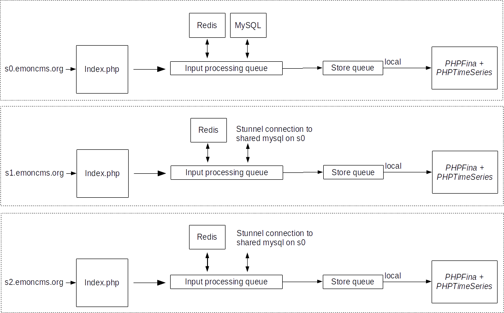

# Emoncms.org variant of emoncms

This variant of emoncms is the version of emoncms running on emoncms.org, it focuses on delivering a scalable multi server implementation.

Unlike the main version of emoncms this version does not support all environments and options. It is designed for Linux servers (typically ubuntu) and focuses on supporting a sub set of feed engines, input processors and visualisations - reflecting the current emoncms.org build. Redis is required. Communication between servers is currently authenticated and encrypted with stunnel and emoncms.org supports https using letsencrypt.

The main intention with this repository is to make the current state of emoncms.org source code open source. It is a custom build of emoncms for emoncms.org. Developments developed on this branch such as turning feed engines into services for multi-server operation might be good to include in the main emoncms repository.

For the full build of emoncms see the main repository here https://github.com/emoncms/emoncms.git

### Key Features

- PHPFina feeds can be run as a service on a 2nd storage server, requests are forwarded from main server and secured with stunnel.
- Data to be written to storage server is transferred via a queue + socket stream for efficient transport and secured with stunnel.
- Faster input post/bulk pipeline in order to release apache connection as fast as possible
- Input processing queue's to reduce apache connection time as above.
- Simplified feed model code, redis always required.

### Installation and setup

1) Copy emoncms folder to /var/www/emoncms

2) Create mysql database

3) Copy default.settings.php to settings.php

4) Enter mysql database settings

5) The default data locations are /var/lib/phpfina and /var/lib/phptimeseries if you wish to change these set accordingly.

6) Open in browser, register new user (the first user created will be an admin user)

7) Send a test input: i.e:

    http://localhost/emoncms/input/post.json?node=1&csv=100,200,300
    
At this point no input will be created as we need to start up an inputqueue processor.

### Setting up an input queue processor

1) Create script-settings.php from default.script-settings.php in MainServerScripts

2) Copy script-settings.php to /etc/emoncms/script-settings.php

    sudo cp script-settings.php /etc/emoncms/script-settings.php

3) Set default script throttle delay's (these need to be adjusted to account for load and input/feed throughput)

    $ php MainServerScripts/set-usleep.php

3) Run input_queue_processor_1.php from terminal temporarily for testing:

    $ sudo php MainServerScripts/inputqueue/input_queue_processor_1.php

The output should look like this:

    Start of error log file
    Buffer length: 0 3000 1
    Buffer length: 0 3000 0
    Buffer length: 0 3000 0
    
3 inputs should now appear in the input list. 

### Storage Server setup

Create a feed from the inputs created above. While the feed appears to update no data will be written to disk as the datapoints are being queued up in a storage server queue.

Run storageserver0.php from terminal temporarily for testing:

    $ sudo php MainServerScripts/storageserver/storageserver0.php
    
Date should now be written to disk.

To view data the graph module needs to be installed in emoncms/Modules/graph, this can be done using git:

    git clone https://github.com/emoncms/graph.git
    
Update the mysql database from the administration interface once installed to create the graph module table.

### Advanced

- [Stunnel configuration](stunnel.md)

### Architecture

Diagram of current (Aug 2017) emoncms.org input processing and data storage architecture:

1. All requests including data from monitoring equipment arrives at the emoncms front controller index.php on emoncms.org. These requests are a mixture of HTTP and HTTPS requests.
2. For input/post and input/bulk data posts, index.php determines the target user from the apikey in the request.
3. These requests are then passed to a script called fast_input.php which decodes the post and bulk data before directing the input data into 6 input processing queues, split by userid e.g: users 1 to 3500 are directed to input queue 1.
4. The input processing queues then work through the inputs in parallel at a speed that is largely determined by the latency on the redis and mysql socket connections.
5. The resulting feed insert/updates are passed to their respective storage queues 0,1,2.
6. Storage server 0 is on the main server alongside the full emoncms installation.
7. Storage server 1 and 2 are on separate machines. Feed data to be written is streamed across to these servers via a socket stream over an encrypted stunnel.

The present implementation provides storage server scalability and has allowed emoncms to grow for a number of years. It does not however provide sufficient scalability of the entry point (apache2) and input processing stage as these are all running on a single machine. With an increasing number of requests arriving at emoncms.org an increasing number of apache2 instances are spun up eating up cpu and memory. At the same time there is plenty of idle cpu and memory on the seperate storage servers.

An alternative approach could be to split emoncms.org more fully over multiple servers so that each server hosts a share of requests, input processing and storage. Each server would be responsible for a block of users. The mysql database is located centrally ensuring that all user-id's and feed-id's are unique across emoncms.org. Each server has its own redis server for caching of fast changing feed meta data such as last time and value limiting the request volume to the central mysql server. 

This solution adds the complexity of different entry points e.g: s0.emoncms.org, s1.emoncms.org. Requesting data across multiple servers may also become more complicated.

### Licence

All Emoncms code is released under the GNU Affero General Public License. See COPYRIGHT.txt and LICENSE.txt.
